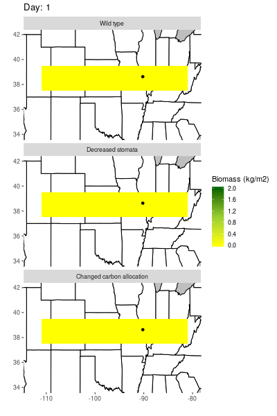
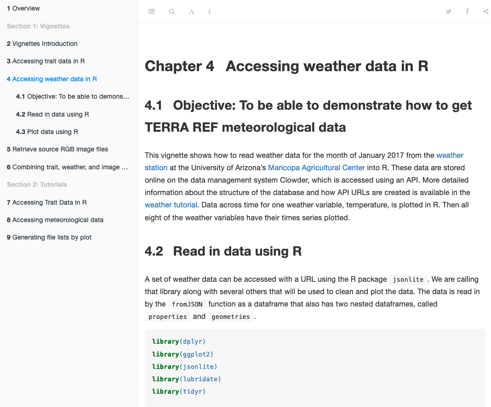

### Agricultural Projects

**Sentinel plant modeling**

We are predicting how plants that have been modified to detect certain biochemical compounds will perform when grown outdoors. We are using several crop models to do so, using the scientific software [PEcAn](https://pecanproject.github.io/) to run these models within a Bayesian framework. These models are documented extensively and reproducibly in [a series of vignettes](https://github.com/az-digitalag/model-vignettes) that I have created. We also generate useful visualizations to display these results for our collaborators, such as the one below. 

<table class="wide">
<tr>
  <td align="center">
    
  </td>
</tr>
</table>

**TERRA REF dataset accessibility**

TERRA REF is a large collection of high throughput phenotyping and remote imaging data on plants. I have improved the ability of researchers to understand and use these complicated, diverse data by documenting their use in [tutorials](https://terraref.github.io/tutorials/) and running [a series of walkthrough webinars](https://mailchi.mp/8abba1e3b0d8/learn-to-access-and-analyze-terra-ref-data). Additionally, we have been producing derived datasets that are compatible with the ICASA standard through a collaborative project with the University of Florida, as described in [this blog post](https://datascience.cals.arizona.edu/news/2020/06/hackathon-building-agricultural-research-data-network). 

<table class="wide">
<tr>
  <td align="center">
    
  </td>
</tr>
</table>

### Graduate Research

**Body size patterns**

My interests in how individual- and species-level traits vary across environmental gradients has resulted in some interesting projects. I have looked for the occurrence of a negative temperature-mass relationship within species (i.e., Bergmann's rule) in a data-intensive way and have not found it to be as prevalent as expected. I have also determined how size variation affects how temperature changes metabolic rates in a diverse group of ectotherm species. Currently, I am working on projects to determine how temperature affects species sizes across time (see [GitHub repo](https://github.com/KristinaRiemer/temporal_MRT)). 

**Phenology assessment**

Another area of interest has been how choice of both data types and models affect interpretations of phenological patterns in various types of organisms. We are currently looking at how large amounts of opportunistically collected data compared to more intensively collected data affect assessment of phenology in bees. Additionally, how phenology patterns in plants differ depending on which models are used to characterize them in combination with choice of opportunistic or intensively collected data. 

### Undergraduate & Postgraduate Research

**Rotifer behavior**

For my undergraduate honors project, I determined the diel vertical migration patterns of rotifers in a lake in northern Minnesota, and its relationship to an invertebrate predator. [thesis paper](http://lux.lawrence.edu/luhp/16/)

**Fish experimental studies**

I spent time during and after my bachelor's degree at Oak Ridge National Laboratory studying the effect of magnetic fields on fish behavior. I set up both lab and mesocosm experiments and collected data on fish movement and startle responses. 

**Cyanobacterial toxins**

We assessed concentrations of microcystin in Green Bay, and corresponding correlations with environmental variables and algae abundance. 
